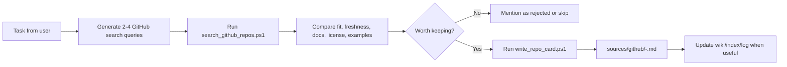

<div align="center">

# GitHub Repo Scout

**A Codex skill for finding task-relevant GitHub repositories, comparing candidates, and archiving useful repo cards into a markdown knowledgebase.**

<p>
  
  
  
  
</p>

<p>
  <a href="#quick-start">Quick Start</a> ·
  <a href="#workflow">Workflow</a> ·
  <a href="#repo-card-output">Repo Card Output</a> ·
  <a href="#install-as-a-codex-skill">Install</a>
</p>

</div>

## Why This Exists

When an agent needs implementation references, the old loop is clumsy: search GitHub in a browser, inspect several repos, copy links, paste them into chat, then repeat the same work next time.

GitHub Repo Scout gives Codex a repeatable path:

- search GitHub with structured metadata;
- compare repositories by fit, freshness, license, docs, and reuse value;
- save only useful candidates as markdown source cards;
- keep a personal knowledgebase from turning into a pile of random links.

## What It Can Do

| Capability | Script / File |
| --- | --- |
| Search GitHub repositories and return normalized JSON | `scripts/search_github_repos.ps1` |
| Fetch repo metadata and write a markdown source card | `scripts/write_repo_card.ps1` |
| Guide repo comparison and shortlisting | `references/repo-evaluation.md` |
| Teach Codex when and how to use the workflow | `SKILL.md` |

## Quick Start

Search repositories related to a task:

```powershell
powershell -ExecutionPolicy Bypass -File .\scripts\search_github_repos.ps1 `
  -Query "llm wiki" `
  -Limit 5
```

Save the search result to JSON:

```powershell
powershell -ExecutionPolicy Bypass -File .\scripts\search_github_repos.ps1 `
  -Query "agent knowledgebase" `
  -Limit 10 `
  -OutJson .\tmp\agent-knowledgebase-repos.json
```

Write a repository card into a knowledgebase:

```powershell
powershell -ExecutionPolicy Bypass -File .\scripts\write_repo_card.ps1 `
  -OwnerRepo "nashsu/llm_wiki" `
  -KnowledgebasePath "D:\path\to\your\knowledgebase"
```

> The default `KnowledgebasePath` is configured for Harzva's local workspace. Pass `-KnowledgebasePath` when using this skill on another machine.

## Workflow



## Search Output

`search_github_repos.ps1` returns JSON shaped for agent use:

```json
[
  {
    "fullName": "nashsu/llm_wiki",
    "url": "https://github.com/nashsu/llm_wiki",
    "description": "LLM Wiki is a cross-platform desktop application...",
    "language": "TypeScript",
    "stars": 7395,
    "forks": 912,
    "openIssues": 80,
    "license": "Other",
    "updatedAt": "2026-05-14T15:29:08Z",
    "pushedAt": "2026-05-14T12:09:22Z",
    "daysSinceUpdate": 0,
    "homepage": "",
    "isArchived": false,
    "isFork": false
  }
]
```

## Repo Card Output

`write_repo_card.ps1` creates a source note like:

```markdown
---
type: github-repo
source: https://github.com/nashsu/llm_wiki
captured: 2026-05-14
status: candidate
---

# nashsu/llm_wiki

## Snapshot

- Repository: `nashsu/llm_wiki`
- URL: https://github.com/nashsu/llm_wiki
- Language: TypeScript
- Stars at capture: 7395
- Forks at capture: 912
- License: Other
```

The generated card includes empty sections for why the repo matters, task fit, reuse ideas, and risks. That makes the agent do the useful judgment work instead of blindly saving search noise.

## Install As A Codex Skill

Clone this repository into your Codex skills directory:

```powershell
git clone https://github.com/Harzva/github-repo-scout.git `
  "$env:USERPROFILE\.codex\skills\github-repo-scout"
```

Then ask Codex for tasks like:

```text
Use github-repo-scout to find strong GitHub references for a local markdown knowledgebase workflow.
```

## Requirements

| Requirement | Notes |
| --- | --- |
| GitHub CLI | Install `gh` and run `gh auth login` |
| PowerShell | Windows PowerShell 5+ or PowerShell 7+ |
| GitHub access | Public search works with normal GitHub auth; private repos require matching permissions |
| Markdown knowledgebase | Any folder can be used with `-KnowledgebasePath` |

## Repository Layout

```text
github-repo-scout/
  SKILL.md
  README.md
  agents/
    openai.yaml
  references/
    repo-evaluation.md
  scripts/
    search_github_repos.ps1
    write_repo_card.ps1
```

## Evaluation Rules

Popularity is not enough. When comparing repositories, prefer:

- direct fit for the current task;
- recent pushes and maintained docs;
- clear examples, tests, and installation path;
- compatible language and architecture;
- explicit license when code may be reused.

Avoid archiving every search result. The knowledgebase should contain shortlisted references, not search exhaust.

## Security Notes

- This skill does not store GitHub tokens.
- Authentication is delegated to `gh`.
- Do not commit generated cards that contain private repository names, internal URLs, secrets, cookies, or copied proprietary content.
- Store short summaries and provenance, not full copyrighted articles.

## Roadmap

- Add issue, release, and README enrichment for shortlisted repos.
- Add a `-Format table` view for human review.
- Add optional MCP wrapper when multiple agents need the same search tool.
- Add tests for JSON shape and card generation.

## License

No license has been declared yet. Add one before distributing reusable code beyond personal or internal use.
